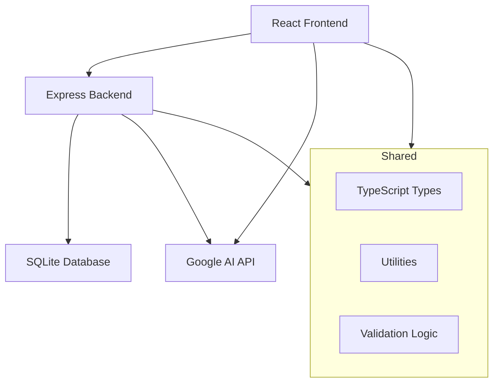

# Resumate 🚀

> AI-Powered Resume Tailoring Platform - Transform your resume for any job with advanced ATS optimization

## ✨ Features

- **🤖 AI-Powered Resume Parsing** - Extract structured data from any resume format
- **🎯 Job-Specific Tailoring** - Automatically optimize resumes for specific job descriptions
- **📊 ATS Optimization** - RARe framework (Readability, Applicability, Remarkability)
- **📱 Responsive Design** - Works seamlessly on desktop and mobile
- **🔒 Secure & Private** - Your data stays with you, API keys stored locally
- **⚡ Fast & Modern** - Built with React, Vite, Node.js, and SQLite

## 🏗️ Monorepo Structure

```
resumate/
├── apps/
│   ├── frontend/          # React + Vite frontend application
│   └── backend/           # Node.js + Express API server
├── packages/
│   ├── shared/            # Shared types, utilities, and constants
│   └── config/            # Shared configuration files
├── scripts/
│   ├── setup.sh           # One-time setup script
│   ├── dev.sh             # Development server launcher
│   └── deploy.sh          # Production deployment script
├── data/                  # SQLite database storage
└── README.md
```

## 🚀 Quick Start

### Prerequisites

- **Node.js** 16+ and npm 8+
- **Git** for version control
- **Google AI API Key** (get from [Google AI Studio](https://aistudio.google.com/))

### 1. Clone and Setup

```bash
git clone <repository-url>
cd resumate
./scripts/setup.sh
```

### 2. Start Development

```bash
npm run dev
# Or use the dev script
./scripts/dev.sh
```

### 3. Access the Application

- 🌐 **Frontend**: http://localhost:3000
- 🔧 **Backend API**: http://localhost:3001
- 💓 **Health Check**: http://localhost:3001/health

## 📋 Available Scripts

### Root Level Commands

```bash
# Development
npm run dev              # Start both frontend and backend
npm run dev:frontend     # Start only frontend
npm run dev:backend      # Start only backend

# Building
npm run build            # Build all applications
npm run build:frontend   # Build only frontend
npm run build:backend    # Build only backend
npm run build:shared     # Build shared packages

# Utility
npm run setup            # Install deps and build shared packages
npm run init-db          # Initialize SQLite database
npm run clean            # Clean all node_modules
```

### Quick Scripts

```bash
./scripts/setup.sh       # Full project setup
./scripts/dev.sh         # Start development servers
./scripts/deploy.sh      # Create production bundle
```

## 🛠️ Development Workflow

### Working with Shared Packages

```bash
# After modifying shared packages
cd packages/shared
npm run build

# Or build from root
npm run build:shared
```

### Adding Dependencies

```bash
# Add to frontend
npm install <package> --workspace=apps/frontend

# Add to backend  
npm install <package> --workspace=apps/backend

# Add to shared package
npm install <package> --workspace=packages/shared
```

### Database Management

```bash
# Initialize/reset database
npm run init-db

# Database location
./data/resumate.db
```

## 📦 Tech Stack

### Frontend (`apps/frontend`)
- **React 19** - Modern UI library
- **TypeScript** - Type-safe development
- **Vite** - Fast build tool and dev server
- **Tailwind CSS** - Utility-first styling

### Backend (`apps/backend`)
- **Node.js + Express** - Server framework
- **SQLite** - Lightweight database
- **Google Generative AI** - AI processing
- **JWT + Helmet** - Security middleware

### Shared (`packages/shared`)
- **TypeScript** - Shared types and utilities
- **Validation** - Common validation logic
- **Constants** - API endpoints and config

## 🎯 Architecture Overview



## 🚀 Deployment Options

### Option 1: Single Server (Recommended for small projects)

```bash
./scripts/deploy.sh
# Upload dist/ to your server
# Set environment variables
# Run npm install && npm start
```

### Option 2: Separate Deployments

- **Frontend**: Deploy to Vercel/Netlify
- **Backend**: Deploy to Railway/Render/DigitalOcean

### Option 3: Docker (Coming Soon)

```dockerfile
# Full-stack container deployment
docker-compose up
```

## ⚙️ Configuration

### Environment Variables

```bash
# Frontend (.env)
VITE_API_URL=http://localhost:3001/api

# Backend (.env)
PORT=3001
NODE_ENV=development
FRONTEND_URL=http://localhost:3000
DB_PATH=../../data/resumate.db
JWT_SECRET=your_secret_here
```

### API Configuration

Users provide their own Google AI API keys through the frontend interface. No server-side API key storage required.

## 🧪 Testing

```bash
# Run all tests
npm test

# Run tests for specific workspace
npm test --workspace=apps/frontend
npm test --workspace=apps/backend
```

## 🤝 Contributing

1. Fork the repository
2. Create a feature branch: `git checkout -b feature/amazing-feature`
3. Commit changes: `git commit -m 'Add amazing feature'`
4. Push to branch: `git push origin feature/amazing-feature`
5. Open a Pull Request

### Development Guidelines

- Use TypeScript for all new code
- Follow the existing code style
- Add tests for new features
- Update documentation as needed
- Use shared types from `@resumate/shared`

## 📄 License

This project is licensed under the MIT License - see the [LICENSE](LICENSE) file for details.

## 🆘 Support

- **Issues**: [GitHub Issues](https://github.com/your-username/resumate/issues)
- **Discussions**: [GitHub Discussions](https://github.com/your-username/resumate/discussions)
- **Email**: support@resumate.com

## 🙏 Acknowledgments

- Google Generative AI for powerful resume processing
- React and Vite teams for excellent developer experience
- Open source community for inspiration and tools

---

**Built with ❤️ by the Resumate Team**